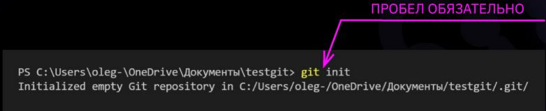
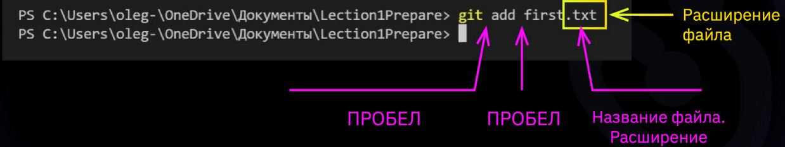
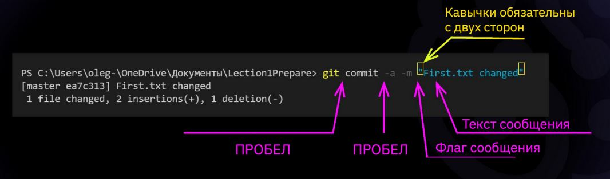
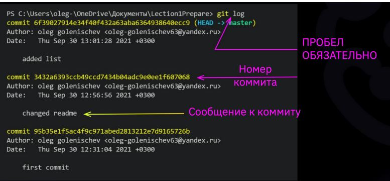
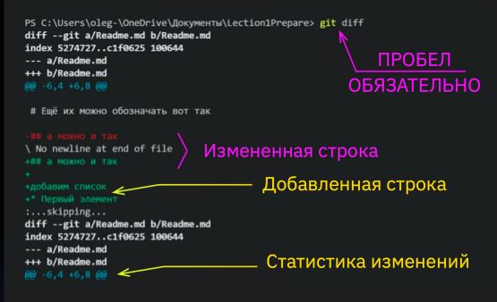

## Команды в Git
1. **Git init -**
* *Инициализация: указываем путь к папке, в которой 
git начнёт отслеживать изменения*.
*В папке создаётся скрытая папка .git*

2. **git status -**
* *Показывает текущее состояние гита, есть 
ли изменения, которые нужно закоммитить (сохранить)*

3. **git add -**
* *добавляет содержимое рабочего каталога, в индекс (staging area) для последующего коммита. Эта команда дается после добавления 
файлов. Писать название целиком не обязательно: терминал дозаполнит данные автоматически*

4. **git commit -** 
* *зафиксировать или сохранить, команда git commit берёт все данные, добавленные в индекс с помощью git add, и сохраняет их слепок во внутренней базе данных, а затем сдвигает указатель текущей ветки на этот слепок.*

5.  **git log -** 
* *Журнал изменений, перед переключением версии файла в Git 
используйте команду git log, чтобы увидеть 
количество сохранений*

6. **git checkout -** 
* *Переключение между версиями, Для работы нужно указать не только 
интересующий вас коммит, но и вернуться 
в тот, где работаем, при помощи команды **git checkout master***

7. **git diff -**
* *Показывает разницу между текущим файлом 
и сохранённым, Перед переключением версии файла в Git 
используйте команду **git log**, чтобы увидеть 
количество сохранений*

8. **git branch -**
* *просмотр веток*

9. **git branch <название новой ветки>-**
* *создание ветки в папке с репозиторием*

10. **git merge <имя ветки для слияния с текущей> -**
* *слияние ветки с текущей*

11. **git branch -d <имя ветки>-**
* *удаление указанной ветки*

12. **git log --graph-**
* *визувлизация веток в графическом виде*